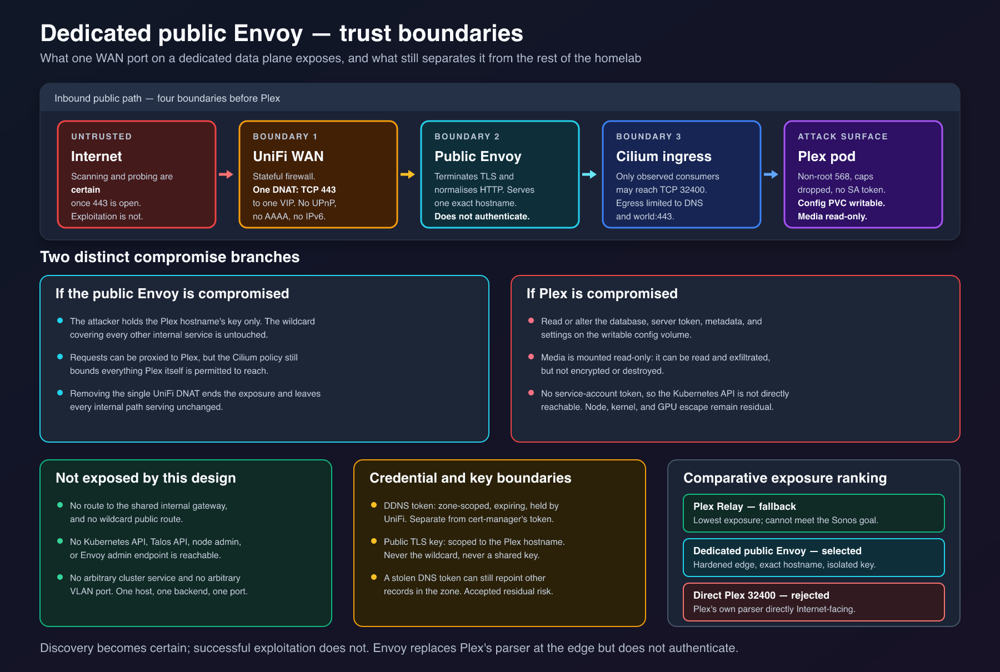

# Plex Public Envoy Experiment

## Purpose

Record the retired design that placed a dedicated Envoy Gateway in front of public Plex
traffic. The design provided strong certificate, hostname, and data-plane isolation and
passed its infrastructure checks, but failed the required Plexamp-to-Sonos playback
test. It is historical design evidence, not a description of the current remote path.

## Design

The experiment used split-horizon DNS for `plex.lab.supermorphic.com`.

Editable source:
[2026-08-03-plex-split-horizon-data-flow.svg](images/2026-08-03-plex-split-horizon-data-flow.svg).

The private horizon kept the Pi-hole answer, shared internal Envoy Gateway, internal
wildcard certificate, and Plex HTTPRoute. The public horizon used a Cloudflare DNS-only
IPv4 record maintained by UniFi DDNS, one WAN TCP `443` DNAT, and a dedicated Envoy data
plane that routed only `plex.lab.supermorphic.com` to `plex:32400`. Relay remained
enabled as a fallback.

The public plane had its own namespace, GatewayClass, EnvoyProxy, Deployment, Service,
MetalLB address pool, exact-hostname listener, HTTPRoute, and certificate. No public
IPv6 or AAAA record was allowed.

## Trust boundaries

Editable source:
[2026-08-03-plex-public-envoy-trust-boundaries.svg](images/2026-08-03-plex-public-envoy-trust-boundaries.svg).

The external data plane never used the shared internal Gateway or its wildcard key. Its
certificate covered only `plex.lab.supermorphic.com`, which limited the value of a key
compromise. Placing the Gateway in a separate namespace also made the Kubernetes API
refuse a reference to the internal wildcard Secret unless a deliberate ReferenceGrant
was added.

The listener accepted one hostname, routes only from the labelled `media` namespace,
and HTTPRoute resources only. This constrained the hostname but could not prove that the
Plex backend was the only possible backend: a future route in the same namespace could
omit its hostname and inherit the listener hostname. The Plex network policy therefore
remained a separate required boundary.

Envoy terminated public TLS and sent plaintext HTTP to Plex over the VXLAN node network.
`BackendTLSPolicy` was rejected because Plex's backend certificate uses an opaque,
externally managed `plex.direct` name and rotation schedule; pinning it would have made
the public path fail silently after certificate change. Cluster-wide transparent
encryption would address that hop generically but was outside this design.

The dedicated certificate exposed the exact hostname in Certificate Transparency logs.
That disclosure was accepted because a public A record, predictable Plex hostname, and
Internet-wide address scanning already made obscurity a weak control. Isolating the key
was the substantive control.

## Operational observations

The controller originally watched namespaces labelled only `internal`. Supporting the
public namespace required an `In [internal, public]` selector. That broader selector is
still present, but no current namespace carries the `public` label and no public
Gateway, listener, route, or data plane remains.

The experiment also established two useful limits:

- in-cluster probing of the split-horizon hostname tested the private path and could not
  prove public reachability; and
- Plex saw the Envoy pod rather than the remote client, so durable attribution depended
  on Envoy access logs. No log collector existed, which made attribution temporary.

## Validation outcome

The public plane was built and exercised. It met the infrastructure and regression
requirements:

- its Gateway was programmed on the dedicated address;
- it presented the single-host certificate externally;
- only TCP `443` answered off-network, the wrong hostname was rejected, and no AAAA
  record existed;
- access logs preserved source attribution without recording the tested token or query
  string; and
- local Plex clients and in-cluster consumers did not regress.

Off-site cellular playback exceeded the Relay ceiling. The required Plexamp-to-Sonos
case still failed: player switching succeeded, but playback stopped immediately and no
audio fetch reached either Envoy plane. Plex's cloud workflow could use the operator
hostname for identity, play-queue, and metadata requests, but Plex could not construct a
media URL that the speaker could consume.

Plex clients trust and consume Plex-managed names such as `*.relay.plex.direct` and the
server's direct `<dashed-ip>.<certificate-uuid>.plex.direct` name. The exact-hostname
Envoy listener intentionally served only the operator name and certificate. That
isolation property was also the incompatibility: it could not provide the Plex-managed
connection name Sonos needed.

The acceptance rule required Plexamp-to-Sonos playback and no hard local regression.
The primary case failed, so the WAN rule was removed even though the remaining checks
passed.

## Removal and retained outcomes

After direct Plex access succeeded, the Flux-managed public Gateway, namespace,
certificate, EnvoyProxy, HTTPRoute, dedicated MetalLB pool, and DDNS drift exporter were
removed. The public MetalLB address is unallocated.

The required external disposition was to delete the public Cloudflare A record, disable
the UniFi DDNS entry, and then revoke the scoped Cloudflare credential. Those resources
are operator-owned state outside Git. Their absence from the repository does not prove
that the actions completed or describe their current state; each must be verified in
Cloudflare and UniFi before relying on the teardown.

Useful independent changes remain:

- the Plex workload and Cilium policy hardening;
- the internal Envoy route and wildcard certificate;
- `timeouts.request: 0s` on the Plex HTTPRoute, which prevents Envoy's 15-second request
  deadline from terminating long Direct Play responses; and
- the expanded Envoy controller watch selector, inert while no public-labelled namespace
  exists.

## Reconsideration conditions

Reconsidering an Envoy public plane requires new evidence that Plex can publish a media
URL accepted by Plexamp, Plex's cloud service, and Sonos while traffic terminates on an
operator hostname and certificate. A new design must preserve local playback, isolate
the public key and data plane, prevent other hostnames and backends from attaching,
retain source attribution, and independently test the public path from off-network.

Without a change in Plex client behavior or a supported way for the proxy to present a
Plex-managed `plex.direct` connection, rebuilding the removed plane would repeat the
same failed compatibility test.
