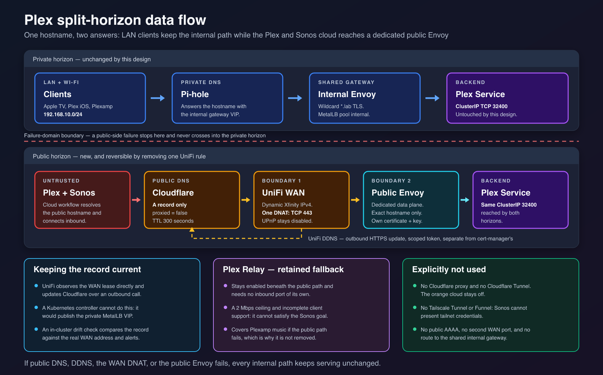

# Plex Public Envoy Experiment

## Purpose and outcome

This retired design tested whether a dedicated public Envoy Gateway could give Plexamp
and Plex's cloud-mediated Sonos workflow a direct path while preserving reliable local
playback. It replaced Relay as the preferred path only for the duration of an attended,
reversible experiment.

The public plane passed its infrastructure, isolation, off-network, and local-regression
checks. It failed the required Plexamp-to-Sonos playback gate and was removed. This
specification records why the architecture was credible, how the failed experiment was
bounded, and what the evidence did and did not establish. It does not describe the
current remote path; [specification 013](013-plex-direct-remote-access.md) owns the later
direct-listener design.

## Problem and prior evidence

Relay and the internal custom access URL could not satisfy local and Sonos clients at
the same time:

| Plex discovery state | Local result | Plexamp-to-Sonos result |
| --- | --- | --- |
| Internal custom URL advertised | Reliable internal Envoy path and full-rate local playback | Player switching failed |
| Custom URL cleared | Clients lost the reliable direct local path and used Relay or cached entries | Sonos playback worked |

One apparently healthy local result after clearing the URL disappeared after client
rediscovery. Plex client caches could therefore create false passes. Plex also labelled
internally proxied sessions as remote because it saw the Envoy pod address. Neither the
Plex route label nor a cached client entry was a trustworthy path oracle.

The objective required both Plexamp-to-Sonos playback without AirPlay and no regression
for Apple TV, Plex iOS, local Plexamp, native Sonos, Tautulli, Homepage, Gatus, or the
internal browser path. Relay-only operation was the lowest-exposure option, but its
2 Mbps ceiling and incomplete client support did not meet that combined requirement.

## Alternatives and selection rationale

| Approach | Decision at the time |
| --- | --- |
| Keep Relay as the primary path | Rejected for the objective. It remained a fallback because it required no inbound listener. |
| Publish Plex TCP `32400` directly | Ranked second. It used Plex's supported name and certificate but put Plex's own parser and API directly on the Internet. |
| Dedicated public Envoy on TCP `443` | Selected for the experiment. It put a hardened parser boundary ahead of Plex, isolated one hostname and key, and allowed one-rule rollback. |
| Cloudflare Tunnel or Tailscale Funnel | Rejected because the fixed Plex/Sonos clients could not supply an additional access credential and the services had media-delivery, name, port, or bandwidth constraints. |
| VPS reverse tunnel | Rejected because it added a public host, credentials, patching, bandwidth cost, and another compromise boundary. |
| Reuse the internal wildcard certificate | Rejected because compromise of the public proxy would expose a key valid for every internal wildcard hostname. A separately keyed wildcard still had the same impersonation authority. |
| Validate Plex backend TLS with `BackendTLSPolicy` | Rejected because the backend name and certificate are externally owned. Binding the route to details outside operator control risked a silent availability failure. The exact vendor derivation and rotation behavior was not proven. |
| Enable cluster-wide transparent encryption | Deferred. It could protect the backend hop generically, but was a cluster-wide CNI and MTU/throughput decision, not an experiment prerequisite. |
| Use ExternalDNS for the public record | Rejected because the in-cluster controller observed the private LoadBalancer horizon, not the dynamic residential WAN address. |
| Add an in-cluster public-path probe | Rejected because split-horizon DNS would silently send it through the private Gateway and create false confidence. |

The selected design was safer than direct Plex for pre-authentication parsing and key
scope, but more complex than either Relay or direct publication. Configuration risk was
therefore treated as a first-order failure mode rather than an incidental cost.

## Experiment architecture

The experiment used split-horizon DNS for `plex.lab.supermorphic.com`.

Editable source:
[plex-split-horizon-data-flow.svg](images/plex-split-horizon-data-flow.svg).

The private horizon kept the Pi-hole answer, shared internal Envoy Gateway, internal
wildcard certificate, and Plex HTTPRoute. The public horizon used a DNS-only IPv4
record, an operator-managed updater for the dynamic WAN address, one WAN TCP `443`
mapping, and a dedicated Envoy data plane routing only the Plex hostname to
`plex:32400`. Relay stayed enabled as fallback. Public IPv6 was outside the design.

The public plane had its own namespace, GatewayClass, EnvoyProxy, Deployment, Service,
explicit non-auto-assigned MetalLB address, exact-hostname listener, HTTPRoute, and
single-host certificate. Its workload shape mirrored the proven internal Envoy plane so
availability differences would not become another experiment variable.

## Trust, safety, and containment boundaries

Editable source:
[plex-public-envoy-trust-boundaries.svg](images/plex-public-envoy-trust-boundaries.svg).

The external data plane never used the shared internal Gateway or its wildcard key. Its
certificate covered only the Plex hostname, limiting the authority of a compromised key.
Placing the Gateway in another namespace also made the Kubernetes API reject a reference
to the internal wildcard Secret unless a deliberate `ReferenceGrant` was added.

The exact-hostname listener and namespace selector constrained attachment but did not
prove that Plex was the only possible backend. A route in the shared `media` namespace
could omit its own hostname and inherit the listener hostname. The namespace selector
could not distinguish that route from Plex's route. Negative tests bounded the current
configuration, but this latent route-admission hole was never converted into a stronger
API refusal.

Envoy terminated public TLS and used plaintext HTTP to Plex across the VXLAN network.
This was the same backend-hop condition accepted for internal services. The dedicated
certificate exposed the exact Plex hostname through Certificate Transparency. That
disclosure was accepted because public DNS and Internet address scanning already made
hostname obscurity weak; limiting key authority was the substantive control.

The `media` namespace required privileged Pod Security Admission for other workloads.
Plex's non-root identity, dropped capabilities, runtime-default seccomp profile, and
disabled service-account token were therefore pinned by source validation rather than
admission policy. The public proxy did not make Plex authentication or application
authorization disappear; it only changed the public parser and TLS boundary.

The experiment-time Plex egress contract allowed off-cluster HTTPS. That was a broad
protocol-and-port grant, not a Plex-cloud allow-list. Access logging existed only in the
public Envoy pod's runtime log. It preserved transient source attribution, but the
cluster had no collector or durable retention. Requests containing credentials in URL
parameters were a specific log-disclosure risk and had to be excluded from captured
evidence.

The dynamic-DNS credential was required to be separate from certificate issuance and
limited to DNS editing for the applicable zone. Zone-wide edit authority remained a
residual risk because the provider could not reliably scope it to one record. A global
account key was a hard stop.

## Containment evidence and corrected interpretation

No Internet exposure was permitted before a Plex-specific `CiliumNetworkPolicy` and its
positive and negative checks existed. The intended consumer inventory combined observed
flows with explicit application contracts because an observation window cannot reveal
an event-driven consumer that happens to be idle.

The initial capture observed the internal Envoy, Tautulli, and host paths but no native
Sonos ingress. At the time, this was accepted as an unobtainable prerequisite: if the
restored Sonos path needed a new identity, policy would fail closed during acceptance.
Later direct-access evidence corrected the interpretation. A working Relay session
terminates on pod loopback, so zero Cilium ingress on TCP `32400` is compatible with
successful native Sonos playback. The capture was still useful, but it did not prove
that native Sonos could not reach Plex.

The capture also showed Plex attempting SSDP/UPnP discovery. The policy deliberately
kept that multicast flow blocked so Plex could not discover a gateway and create an
automatic WAN mapping if router-side UPnP was enabled accidentally. Loss of Plex DLNA
discovery was accepted because the supported Sonos path did not depend on SSDP. The
capture separately confirmed that the CSI node component, not the Plex pod, owned SMB
traffic, so the pod needed no SMB egress.

## Experiment method and gates

The sequence separated observation, containment, inert public infrastructure, external
DNS, and final WAN activation. No earlier step made Plex Internet-reachable. Each shared
or containment change had to preserve the internal path before the next step could
begin.

The experiment contract required:

- an authoritative pre-containment Hubble inventory, supplemented by declared consumer
  contracts;
- a baseline client matrix and the same matrix with the WAN mapping active;
- forced rediscovery before each client row so cached connections could not pass;
- separate path evidence from the serving Envoy pod, public access-log presence, and
  sustained bitrate rather than Plex's route label;
- off-network tests for the presented certificate, wrong hostname, reachable port set,
  and absence of a public IPv6 path;
- negative tests for route scope, the Envoy admin endpoint, Plex lateral movement, the
  Kubernetes API, and every intended consumer; and
- an attended rollback rehearsal after the active-path checks.

Hard-stop conditions included a local-client regression, a non-Plex hostname attaching,
any unexpected WAN port, any public IPv6 path, an automatic UPnP/NAT-PMP mapping, or the
dynamic-DNS system requiring a global account key. Success required the
Plexamp-to-Sonos row and every hard local row. Off-site playback and Relay fallback were
useful evidence but did not override the primary gate.

Removing the WAN mapping was expected to block new sessions. Whether established router
conntrack entries were removed was not proven, so mapping removal was not evidence that
every existing session had ended.

## Observed result and evidence limit

The public plane met its infrastructure and regression gates:

- the dedicated Gateway was programmed on its intended address;
- the public endpoint presented the single-host certificate rather than the internal
  wildcard;
- only TCP `443` answered in the bounded off-network scan and the wrong hostname was
  rejected;
- access logs retained source attribution without retaining the tested credential; and
- local Plex clients and in-cluster consumers did not regress.

Off-site cellular playback also exceeded the Relay ceiling. The required
Plexamp-to-Sonos case still failed. Control-plane identity, play-queue, and metadata
requests succeeded. The player switch succeeded, playback stopped almost immediately,
the speaker received no usable media URL, and no audio fetch reached either Envoy data
plane.

The leading explanation was a name and certificate incompatibility: the proxy
intentionally served only an operator hostname, while supported Plex clients consume
Plex-managed `plex.direct` connection names and certificates. That mechanism fit the
empty-media-URL observation, but it was not proved as the exclusive root cause.

Later direct-access work established another blocker. The Plex policy denied an outbound
check to Plex's own WAN-derived `plex.direct` endpoint on TCP `32400`, which prevented
Plex from publishing a native direct connection. The corrected policy was never part of
this Envoy experiment. The hostname/certificate account therefore remains the leading
inference, qualified by evidence that the publication path itself was also incomplete.

## Removal, retained outcomes, and deferred boundaries

The primary gate failed, so the WAN mapping was removed. After direct access was proven,
the Flux-managed public Gateway, namespace, certificate, EnvoyProxy, HTTPRoute, dedicated
MetalLB pool, and DNS drift exporter were removed. Git proves that those cluster
resources left desired state. It cannot prove deletion of the external DNS record,
disablement of the router-side updater, or credential revocation; those remain
operator-owned facts that require direct verification.

Useful independent changes remained:

- Plex workload and Cilium policy hardening;
- the internal Envoy route and wildcard certificate;
- `timeouts.request: 0s` on the Plex HTTPRoute so long Direct Play responses are not
  terminated by Envoy's request deadline; and
- the widened Envoy controller watch selector, inert while no namespace carries the
  public label.

This lineage did not add durable request-log retention, external reachability
monitoring, stronger route admission, narrower Plex egress, public IPv6, transparent
node-network encryption, or permanent exposure. Those omissions were inputs to any
later design, not claims that the risks were solved.

## Reconsideration conditions

Reconsidering an Envoy public plane requires new evidence that Plex can publish a media
URL accepted by Plexamp, Plex's cloud service, and Sonos while traffic terminates on an
operator hostname and certificate. It also requires a publication self-check that works
under the proposed Cilium policy, not an assumption carried from this run.

A new design must preserve local playback, isolate the public key and data plane,
prevent unintended routes and backends from attaching, retain safe source attribution,
prove the public path from off-network, and define how established sessions end during
rollback. Without a material client or proxy capability change, rebuilding the removed
plane would repeat the failed compatibility gate.
