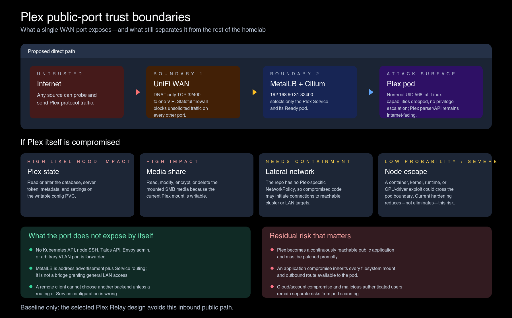

# Plex Direct Remote Access

## Purpose

Retain as permanent the IPv4-only remote path that satisfied the Plexamp and Sonos
objective without regressing local playback. The design publishes Plex's own TLS
listener through one router rule. It does not recreate the retired public Envoy plane,
expose another media application, or add a public IPv6 path.

## Architecture

The public remote path uses the connection Plex derives from the observed WAN address:

```text
<wan-address-with-dashes>.<hash>.plex.direct:32400
  -> residential WAN IPv4 resolved from that name
  -> one UniFi DNAT: WAN TCP 32400 -> 192.168.90.31:32400
  -> Plex LoadBalancer Service
  -> Plex Media Server
```

Plex publishes this connection after it learns the WAN address and the manual public
port. It also checks its own WAN-derived `plex.direct` address on TCP `32400`, which is
why the network policy admits that public egress port. Plex owns the `plex.direct` DNS
name and certificate. The remote path needs no operator-managed public DNS record, DDNS
updater, public Gateway, or Internet-facing operator certificate.

The Plex Service requests the explicit LAN address `192.168.90.31` from MetalLB's
non-auto-assigned `internal` pool. It exposes only TCP `32400` and uses
`externalTrafficPolicy: Local` so Plex and Hubble retain the real off-cluster source
identity instead of a node SNAT address. It sets `allocateLoadBalancerNodePorts: false`
so the Service does not retain a second Kubernetes listener form that the design does
not use. The LoadBalancer makes Plex reachable on the LAN; only the external UniFi DNAT
creates Internet exposure.

## Local and client-discovery paths

`https://plex.lab.supermorphic.com` remains the internal browser and application route:
Pi-hole resolves it to the shared internal Envoy Gateway, which forwards to
`plex:32400`. The internal HTTPRoute uses `timeouts.request: 0s`, because Envoy's
default 15-second request deadline interrupts long Direct Play responses.

The validated Plex **Custom server access URLs** list is different. It contains exactly
one entry: the TLS-valid name derived from the private Plex LoadBalancer address:

```text
https://<load-balancer-address-with-dashes>.<certificate-uuid>.plex.direct:32400
```

This private address-derived name resolves directly to the LAN LoadBalancer. It is a
local client-discovery path and never routes through the WAN DNAT. It coexists with the
separate WAN address-derived remote connection that Plex publishes.

The internal Envoy hostname must not be advertised through the custom URL setting.
During the accepted experiment, Plex's cloud service preferred that Envoy URL and
handed it to the Sonos speaker. The Sonos VLAN could not route to the internal Gateway
address, so the cast failed. Replacing it with the LoadBalancer-derived `plex.direct`
URL restored Plexamp-to-Sonos playback and did not regress full local Direct Play.

Plex's **LAN Networks** setting includes the trusted client VLANs and the Pod CIDR
`10.244.0.0/16`, but excludes the cluster VLAN `192.168.90.0/24`. Local application
sessions use the internal Envoy route, so Plex sees an Envoy Pod address rather than the
original client address. Without the Pod CIDR, Plex classifies those local sessions as
remote. They can then consume the per-user remote stream allowance and receive remote
quality treatment, which can throttle normal household playback. Tautulli's current
activity view is the independent check that a local session is classified as **LAN**.

The cluster VLAN is deliberately excluded. The current LoadBalancer uses
`externalTrafficPolicy: Local`, which preserves an off-site client's public source
address. If that policy changed to `Cluster`, a remote connection could instead reach
Plex with a node source address from `192.168.90.0/24`. Treating that whole VLAN as LAN
would then exempt the Internet session from remote limits. The Pod CIDR has no equivalent
off-cluster source risk because external clients cannot originate with a routable Pod
address.

Pi-hole must allow the private answer embedded in `plex.direct`; DNS rebind protection
must not strip it. The Sonos VLAN also needs a router rule to the Plex LoadBalancer on
TCP `32400`. These are operator-owned runtime settings, not Git-managed cluster state.

## Exposure and containment

The router boundary is exactly one TCP forward to the Plex LAN address and internal port
`32400`. UPnP and NAT-PMP remain disabled so Plex cannot create another mapping. No
public IPv6 or AAAA path is part of this design.

The Plex Cilium policy admits `world` only on TCP `32400`. This allows the WAN-forwarded
traffic and, because Cilium classifies addresses outside the cluster as `world`, also
admits LAN clients to the LoadBalancer address. Other ingress ports remain closed. The
policy retains the exact in-cluster consumers and the bounded egress described by the
Relay and hardening specification.

Plex Remote Access and authentication remain enabled, the manually specified public port
matches `32400`, Relay remains enabled as a fallback, and unauthenticated-network
settings remain empty. Account multi-factor authentication remains enabled, remote
streams stay bounded per user, and the client network remains IPv4-only. Changing Secure
Connections is outside this design.

The direct listener has no rate limiter or hardened edge proxy before Plex. A public
Plex parser or API vulnerability therefore has greater consequence than it did behind
Envoy. The compensating controls are the non-root and capability-free workload, pinned
image, read-only media, absent Kubernetes API token, restricted Cilium policy, detection,
prompt patching, and the ability to remove one DNAT quickly.



## Detection and response

The permanent design retains the Hubble-derived remote-connection alerts, missing-metric
alerts, workload-policy-denial alert, Prometheus evaluation, Alertmanager route, and
synchronous ntfy adapter. A 2026-08-22 verification observed healthy live rules and
targets and both a firing and resolved notification through the production route. That
dated result does not prove continuous detector health.

The guarded Flux delivery exercise uses Alertmanager's aggregate webhook counters only
after it proves that ntfy is the sole loaded webhook receiver and that both success and
failure series exist. This prevents unrelated webhook traffic from satisfying the
delivery oracle. Detection remains aggregate: it does not identify a remote client,
detect every Plex authentication failure, or retain application requests. Source
attribution and session review remain bounded operator actions.

## Validated result

The dated acceptance exercise established all required behavior:

- Plexamp switched to Sonos and played without AirPlay;
- native Sonos playback worked after its router rule was corrected to the Plex
  LoadBalancer address;
- Apple TV, Plexamp local playback, Plex iOS 4K playback, Tautulli, Homepage, and Gatus
  matched or exceeded baseline behavior;
- Plex Web-to-Sonos playback also began working;
- off-site cellular reached Plex through the DNAT rather than Relay; and
- an off-network scan found TCP `32400` open, the other scanned ports filtered, no AAAA
  record, and no automatic UPnP or NAT-PMP mapping.

The off-site client retained a 2 Mbps client-side quality cap, so that exercise proved
the direct route but not remote bitrate above 2 Mbps. Relay fallback was not re-tested
because doing so required interrupting the household direct path.

The result also corrected two earlier inferences. Zero Cilium ingress on `32400` during
native Sonos playback can represent a working Relay session on pod loopback, not a
broken Sonos path. Plex's reported Remote Access reachability state is also not a routing
oracle: Sonos had played while that state reported not reachable. The published
connection name and actual client URL are the useful evidence.

## Authority and recovery boundary

Git proves the Service, HTTPRoute, workload, and Cilium policy desired state. It cannot
prove that the UniFi DNAT, Plex settings, Pi-hole rebind exception, Sonos VLAN rule,
public IPv6 filtering, or account settings still match this design. Current operation
requires separate, sanitized checks of those systems and an actually off-network scan.

Plex retains a read-only media mount and cannot delete library media. Radarr and Sonarr
remain the removal authorities for their managed libraries, while download cleanup stays
under the qBittorrent and qbit_manage policy. The NAS account remains limited to the
media share and the write access that media automation requires. Plex configuration,
database, identity, and watch history require recoverable backups. Bulk media has no
independent backup by operator decision; total loss requires reacquisition and can be
slow or incomplete.

Removing the DNAT blocks new remote connections but existing router conntrack entries
can survive. Restarting Plex evicts established sessions but also interrupts every local
client because Plex is a single `Recreate` Deployment on a `ReadWriteOncePod` claim. A
restart is therefore an incident action when eviction is required, not a routine part
of removing exposure.

Review this design after a change to the gateway mapping, public DNS, address-family
configuration, Plex network or account settings, Service listener shape, Cilium policy,
notification route, or recovery design. A calendar-based review is not required.

## Consequences

This permanent path is smaller and more compatible than the public Envoy design and
exposes no operator-controlled TLS key. Its cost is continuous Internet reachability to
Plex's own listener. The [remote-access detection specification](020-plex-remote-access-detection.md)
defines the available aggregate signals and their limits.
