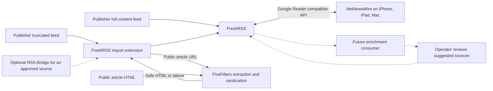

# Self-hosted news reading

## Purpose and decision status

Design for [issue 274](https://forgejo.infra.supermorphic.com/supermorphic/homelab-talos/issues/274):
replace or reduce Apple News dependence with operator-curated reputable sources,
readable full articles, and synchronized native reading on iPhone, iPad, and Mac.
This is a proposed design for operator review, not a deployed service or an
implementation plan. Source research supports the architecture; article quality,
container compatibility, recovery, and native synchronization still require acceptance.

Select FreshRSS as the subscription and reading-state authority, self-hosted
FiveFilters Full-Text RSS as the preferred extraction service, and NetNewsWire as
the native client. Full-text extraction is part of v1. Recommendations and learning
are independent future capabilities. A failed extraction may produce an explicit
summary-only result; pervasive failure for the selected public sources is not a
successful full-text deployment.

Assume one operator account, private access through the existing internal Gateway
and Tailscale path, and a modest curated feed collection. Multiple users, public
exposure, and high-volume archival ingestion require a design review. No evidence
found in this research requires replacing FreshRSS for Talos or NetNewsWire.

## Component boundaries

| Responsibility | Owner | Contract |
| --- | --- | --- |
| Source acquisition | Publisher feeds; RSS-Bridge only for individually approved exceptions | Obtain the operator-selected feed and retain publisher identity, article links, dates, and available summaries. |
| Full-text extraction and sanitization | A narrow FreshRSS import extension calling FiveFilters; FreshRSS sanitation and optional source selectors | Produce safe article HTML before storage, or retain an explicit summary-only fallback without downgrading an existing full body. |
| Aggregation and state | FreshRSS | Own subscriptions, categories, filtering, stored article bodies, read/unread state, and favorites. |
| Optional enrichment and curation | Future independent consumer | Derive annotations and suggestions without taking ownership of subscriptions or reading state. Absent in v1. |
| Native presentation | NetNewsWire | Render the FreshRSS-provided body and synchronize supported state through its FreshRSS account. |

Arrows describe content flow. FreshRSS initiates feed polling; FiveFilters fetches
article pages on an extraction request. The import extension runs inside FreshRSS,
not as another service. Neither service
pushes articles to the native clients. Clients synchronize against FreshRSS.

## Source acquisition

The operator adds and organizes feeds in FreshRSS. Prefer publisher-provided
full-content RSS or Atom and subscribe directly when it meets article-quality
requirements. Do not fetch an article page merely because full-text extraction is
available. For a consistently truncated feed, enable server-side extraction in its
FreshRSS settings while keeping the publisher feed URL as the subscription address.
Extraction policy is stored with FreshRSS source settings, not in a second
subscription database. Preserve the publisher's
website as the source link and a normal publisher article URL on each item.

Use one subscription path per source. Do not subscribe to both direct and converted
copies. Do not replace subscription URLs when an extractor fails. Changing a
source's extraction policy must preserve its feed and item identities, categories,
and read state. An actual publisher feed URL change requires an in-place migration
verified against existing articles and read state, with a backup first.

Feed polling belongs to FreshRSS. Refresh work must be serialized and bounded;
extraction timeouts must fit inside the feed-refresh deadline. Cache repeated
extraction work, respect publisher rate limits, and back off on failures. When the
extraction work budget is exhausted, admit remaining new items with their summaries
rather than dropping them. Test large feed batches for this behavior. If a source
repeatedly exceeds the budget, adjust its admitted workload or classify it as
summary-only pending an explicit decision. Feeds are rolling windows, not guaranteed
archives; a prolonged outage
can lose items that disappear upstream before the next successful poll.

RSS-Bridge is absent from the initial deployment. Add it only when a selected source
has no usable feed and a reviewed bridge produces acceptable results. It owns feed
generation only. Generated items follow the same extraction, identity, and fallback
rules; a bridge does not become a discovery engine or subscription authority.

Supported publisher-authenticated or private feeds may be added through the
publisher's documented mechanism. Keep their credentials in protected runtime
configuration and backups, out of Git, logs, metrics, and public exports. Do not
pass credential-bearing private feed URLs through the public-article extractor.
Private full-content feeds go directly to FreshRSS; private feeds with summaries
remain summaries unless the publisher supplies a supported full-content feed.

## Full-text extraction and sanitization

### Selected integration

Use FiveFilters's article-extraction API behind a narrow FreshRSS import extension.
Its [documented article interface](https://help.fivefilters.org/full-text-rss/usage.html)
returns extracted HTML. The extension applies before persistence, so the full body
is available through the sync API, not only in the FreshRSS web view. It owns
per-source opt-in, bounded requests, result validation, safe fallback, and content
provenance inside FreshRSS. The extraction service owns no
user accounts, categories, read markers, or independent article archive. Its cache
is disposable. FreshRSS stores the resulting content so extraction availability is
not required to read an already synchronized article.

FiveFilters documents HTML output, retained images and figure elements, link
preservation, and HTML safety filtering. These are useful capabilities, not proof
that every article is complete. The import extension must validate the response
and implement fallback itself; FiveFilters's separate feed-conversion fallback
does not establish the article API's behavior. Check request and failure semantics
against the selected package.

FreshRSS provides pre-insert/update extension hooks. The
[Readable extension](https://github.com/printfuck/xExtension-Readable/blob/master/extension.php)
demonstrates calling FiveFilters before insertion and retaining the feed body on
errors. Treat it as an integration reference, not a package accepted without review.
The selected integration must bound request time/size, encode URLs correctly, work
on both insertion and relevant update paths, and preserve source metadata and state.
Verify hook ordering against the pinned FreshRSS release: safe content must reach
storage/API responses and content-based filter actions must see the effective body.
Display-only processing does not satisfy either requirement.
Reuse a maintained extension if it meets this contract; otherwise the narrow
adapter is repository-owned. No general ingestion framework or background job queue
is justified for v1.

Prefer a current upstream self-hosted distribution packaged on a supported PHP
runtime. The upstream [hosting documentation](https://help.fivefilters.org/full-text-rss/hosting.html)
distinguishes the purchased self-hosted distribution from its hosted services; acquisition remains an
operator decision. This design authorizes no purchase or subscription. The
commonly referenced community Docker build is not the deployment choice: its
[Dockerfile](https://github.com/heussd/fivefilters-full-text-rss-docker/blob/master/Dockerfile)
uses an obsolete PHP runtime. A recent image rebuild does not establish that its
application or runtime is current. Do not silently substitute the old free package.

Package provenance, license obligations, supported-runtime behavior, amd64 image
availability, and reproducible image construction are release admission conditions.
Pin the selected application, runtime, and extraction rules in executable source.
Review site-rule updates through Git; runtime downloads must not silently change
extraction behavior. Upstream has documented
[PHP 8 compatibility work](https://www.fivefilters.org/2021/full-text-rss-397/),
but that is not evidence for an untested current runtime/package combination.

### Article fidelity

Preserve the editorial article body: paragraphs, headings, lists, quotations,
emphasis, useful links, tables where supported, images, figures, captions, credits,
and meaningful alternative text. Resolve relative links and lazy-loaded editorial
image URLs into usable absolute URLs. Preserve their reading order. The target is
semantic article formatting under NetNewsWire's typography, not the publisher's
page layout, fonts, scripts, or interactive widgets.

Remove navigation, advertisements, tracking pixels, newsletter prompts, related
story widgets, cookie banners, and identifiable sponsored blocks. Preserve
editorial disclosures and quoted content; keyword matching alone must not delete
legitimate reporting. A whole sponsored story should be handled by an explicit
FreshRSS source/filter rule rather than guessed from a paragraph and silently lost.

Keep HTML safety filtering enabled. Retain text and safe image/formatting elements
while excluding executable content, forms, event handlers, unsafe URL schemes,
and embedded tracking frames. FreshRSS's sanitation remains a second boundary;
verify that extension-provided bodies pass through it before API delivery rather
than assuming a pre-insert hook automatically inherits the usual sanitation path.
Do not disable sanitization to rescue a difficult figure: use a safe static image,
caption, or publisher link, and classify a materially incomplete article as such.
Publisher-provided full-content feeds also require sanitation and review for
embedded clutter; direct ingestion is not a declaration that publisher HTML is safe.

Use reviewed per-site extraction rules when automatic extraction omits content or
retains clutter. FiveFilters supports rules to select body content, strip elements,
and adjust pruning; aggressive pruning can also remove wanted editorial material.
[Site-pattern behavior](https://help.fivefilters.org/full-text-rss/site-patterns.html)
therefore needs representative article checks after changes. FreshRSS's own
selectors may supplement individual sources, but each source has one primary
extraction path. Avoid fetching and rewriting the same article through both engines.

### Access boundary

Fetch only publicly accessible article content through ordinary publisher access.
Do not bypass authentication, paywalls, access denials, or bot challenges. Do not
reuse browser sessions, impersonate privileged crawlers, unlock hidden premium
content, or use archive/proxy services to obtain restricted text. Review upstream
site rules against this requirement before enabling them; successful HTML parsing
does not establish that the content was authorized for access.

Paywall or login indicators override an apparently successful content extraction.
Use the publisher's available summary and link for new/summary-only entries; retain
an existing full body previously obtained through permitted access. No headless browser, CAPTCHA
solver, or shared Crawl4AI dependency is selected for v1. A JavaScript-only article
that lacks usable public HTML receives the same honest fallback.

### Failure and fallback behavior

| Condition | Stored/readable result | Recovery and consequence |
| --- | --- | --- |
| Publisher supplies an adequate full-content feed | Sanitized publisher body | Bypass article-page extraction. |
| Public article extracts successfully | Sanitized extracted body with publisher link | Retain stable item identity across repeated polls. |
| Per-item timeout, unavailable page, empty output, or recognized extraction failure | For a new item, original title, available summary, and link with a brief full-text-unavailable notice; for an existing full article, keep its stored body | Admit the item and preserve state. Retry only when the normal ingestion path revisits it; archive backfill is not guaranteed. |
| Login, paywall, access denial, or challenge | For a new/summary-only item, publisher-provided headline/summary and link; retain any existing full body previously obtained through permitted access | Do not attempt alternate access methods. |
| Output is nonempty but omits sections/figures or contains page chrome | Treat the source as failing article-quality acceptance | Correct its rule or deliberately use summary-only ingestion; never equate HTTP 200 with completeness. |
| Extractor is down or exceeds the refresh work budget | Previously stored full bodies remain; new items enter as summaries with a full-text-unavailable notice | Bypass further extraction attempts for the bounded refresh cycle and continue feed ingestion. Do not change subscription URLs. |
| Upstream feed is invalid, gone, or rate-limited | Keep previously stored items and state | Surface source failure and back off. Do not unsubscribe automatically. |
| Editorial image is unavailable | Preserve article text, caption/alt text, and publisher link | Show the missing asset honestly; do not claim a complete offline copy. |
| Content changes after initial sync | A successful extraction may update the same stored item; failure must not downgrade an existing full body | Preserve read/favorite state. NetNewsWire may retain an older cached body; publisher corrections remain available at the original link. |

The import extension retains items when full-text extraction fails. A short notice
should explain that full text is
unavailable and provide the publisher link; internal URLs and parser errors do not
belong in the article. No automatic detector can prove article completeness.
Representative source review plus visible failure reporting remains necessary.

Keep the original feed body, extraction outcome, and effective reading body as
entry-associated data in FreshRSS. The extension, not an extractor cache, owns the
decision to replace a body. A valid full extraction may replace a fallback summary;
an error or rejected extraction cannot replace an already accepted full body. Read
and favorite markers remain unchanged. Do not infer outcome solely from content
length or a string embedded in the article. Clearing an extractor cache must not
change this policy.

A later successful refresh only repairs old summaries if FreshRSS revisits those
entries and the extension processes them. Unchanged upstream items may not enter
an update hook, and items that have left the feed cannot be recovered by polling.
V1 promises correct summary-to-full transitions when reprocessed, not an automatic
archive backfill service. Native clients may still retain old cached bodies.
Operator-triggered historical reprocessing would need a separately accepted bounded
procedure. Do not manufacture new IDs or resubscribe to force article updates.

## Aggregation, state, and recovery

FreshRSS is authoritative for subscriptions, categories, source filtering, stored
HTML, read/unread markers, and favorites. Manage subscriptions and advanced rules
in FreshRSS; NetNewsWire changes to supported reading state synchronize back to
that account. Do not create parallel local/iCloud subscriptions for the same feeds.
FreshRSS saved searches and advanced filters need not appear as equivalent controls
in NetNewsWire. Select server-side effects deliberately: marking an article read is
not the same as excluding it from synchronization or deleting it.

Select SQLite on one retained Longhorn claim for the initial single-operator service.
[FreshRSS supports SQLite directly](https://freshrss.github.io/FreshRSS/en/admins/DatabaseConfig.html).
Use a single FreshRSS replica with `Recreate` for the `ReadWriteOnce` claim. Keep
refresh scheduling with that workload; do not create a second Pod writer on the
same claim. This trades brief rollout downtime for a small, recoverable state model.
The existing n8n and automation-data databases have separate ownership contracts
and are not a general-purpose database pool for this service.

The recovery unit is FreshRSS's complete data/configuration, including extraction
settings and entry provenance, plus a consistent user database backup and the exact
deployed software/extension/configuration revisions. OPML is a
portability aid, not a recovery backup: it cannot restore article bodies, read
state, or all source settings. Upstream describes the
[required data and database backup surfaces](https://freshrss.github.io/FreshRSS/en/admins/05_Backup.html).
Use a coordinated backup with refresh and configuration writes quiesced, validate
the SQLite copy, then retain it through the established off-cluster storage path.
An uncoordinated copy of an active database or a healthy Longhorn replica alone is
insufficient evidence of recoverability.

Recovery must remain possible without FreshRSS or the extractor running:

1. Recover the reviewed Git revision, pinned images, encrypted bootstrap material,
   operator-held decryption authority, and a verified off-cluster backup.
2. Restore FreshRSS into a new isolated claim with polling and client access disabled.
   Use the software revision that created the backup before considering migrations.
3. Check database integrity, login, source settings, article bodies, categories,
   favorites, and read/unread state. Recreate the extractor with its pinned rules;
   an empty extractor cache is expected.
4. Enable controlled polling and verify stable item identities and fallback behavior.
   Restore private routing, then reconcile native clients against the recovered server.
   A restore can lose state newer than the backup; do not let stale client queues
   silently undo the verified recovered state.

An isolated restore drill is required before treating this as the primary reader.
Capacity, retention, backup frequency, and concrete guarded recovery commands belong
to implementation configuration and command help once the design is approved.
Unread and starred content must not be silently discarded to satisfy a storage cap.

## Native presentation and optional image privacy

NetNewsWire is the selected free native iPhone/iPad/macOS client. No subscription,
advertisements, or upgrade nagging is an acceptance requirement for the client. Its
[published features](https://netnewswire.com/) include FreshRSS synchronization.
Use FreshRSS's [Google Reader compatible API](https://freshrss.github.io/FreshRSS/en/developers/06_GoogleReader_API.html)
with a separate API password and trusted HTTPS. Preserve encoded API paths through
Envoy. Avoid an interactive authentication proxy that intercepts native API calls.
Device OS compatibility must be checked against the chosen stable NetNewsWire release.

The current [NetNewsWire Reader API implementation](https://github.com/Ranchero-Software/NetNewsWire/blob/main/Modules/Account/Sources/Account/ReaderAPI/ReaderAPIAccountDelegate.swift)
maps the API's `summary.content` into article HTML. Despite that field name, it can
carry the full stored body. This supports server-side extraction as the design;
it does not prove rendering on the operator's installed clients. Acceptance must
use the normal article view, with client-side reader extraction unnecessary.

Synchronize subscriptions/categories and bidirectional read/unread and starred
state on all three device types. Exercise offline actions followed by reconnection.
Do not promise immediate background sync on iOS, identical advanced-filter UI, or
automatic replacement of cached bodies. Offline text depends on prior client sync;
offline image availability requires separate testing.

Image proxying/caching is optional and disabled in the base design. Without it,
native clients may contact publisher/CDN image hosts; HTML cleanup does not remove
that privacy exposure. A future proxy must rewrite image URLs in the HTML delivered
by the API, including responsive-image alternatives, not just the FreshRSS web UI.
It must use a client-reachable private HTTPS endpoint, work without browser session
cookies, and avoid exposing long-lived account credentials in URLs. Restrict it to
approved image fetches with bounded cache size and lifetime. Prove publisher/CDN
requests disappear from native-client traffic before claiming image privacy. Images
already cached by clients cannot be retroactively brought under that guarantee.

## Optional enrichment and curation seam

Keep v1 usable with no enrichment process, model, queue, vector database, or extra
article archive. A later consumer may read FreshRSS articles through a supported
API using the narrowest available access. The Google Reader API is not inherently
read-only; do not describe a full API credential as a read-only authorization.
Any future service identity and write boundary need their own design review.

Associate derived results with a stable FreshRSS article identity, source identity,
original/canonical publisher URL, and content revision/hash. Keep derivation/model
provenance separate from publisher content. This is an interface boundary, not a
new registry or schema to build in v1. Derived state is disposable and can be
recomputed; FreshRSS retains authority over the originals and user state.

This permits cross-source duplicate grouping, semantic categories, personalized
ranking, a separate For You view, suggested sources, and local-LLM summaries.
Deduplication should initially group related copies without destroying the originals
or their separate read markers. Summaries must be labeled as generated, retain
publisher attribution, and never replace the editorial body. Article content is
untrusted input and cannot issue subscription or tool commands to an enrichment job.

Recommendations go to an operator review surface. Only operator approval adds a
source to FreshRSS. Disabling enrichment must leave ingestion, full-text reading,
filtering, and synchronization intact. NetNewsWire is not assumed to support custom
ranked streams or arbitrary annotations; a future For You presentation may need a
separate view. Do not distort v1 feed ordering or manufacture duplicate subscriptions
to simulate that feature.

## Platform fit and operating boundaries

Follow the [Talos/Flux platform](010-talos-flux-platform.md) with a dedicated news
namespace and app-local Flux packages for FreshRSS and the extractor. Use the
existing internal Gateway, certificate, DNS, and private Tailscale route for the
FreshRSS UI/API. Public exposure and new Talos host services are outside this design.
PHP and the web server belong in containers; no host package installation is needed.

Keep the extractor a ClusterIP service reachable by FreshRSS only, with no public
route or native-client dependency. Admit workloads under restricted Pod Security:
non-root execution, dropped capabilities, no privilege escalation, no host mounts,
and no Kubernetes service-account token. Container startup, writable paths, and
refresh scheduling must be proven under those settings before image selection is
complete; a Docker Compose example alone does not prove Kubernetes compatibility.

Apply default-deny network policy with scoped ingress, DNS, public publisher HTTP(S),
and the specific FreshRSS-to-extractor exception. Validate destinations and redirects
and exclude private, loopback, link-local, metadata, and cluster destinations from
publisher fetching. A publisher feed is untrusted even when the operator selected
it. Preserve the intentional internal extractor exception without granting general
internal fetch access. FreshRSS's internal-host fetch allowance must name only the
extractor service and port needed for extraction calls. The extension must preserve
this restriction rather than bypassing it with an unrestricted HTTP client.
Validate these as new-service admission requirements, not as
claims about existing deployed controls.

Bound response size, redirect count, per-article time, whole-feed time, concurrency,
and temporary cache/disk use. Independent probes distinguish serving FreshRSS from
successful feed ingestion. Observe refresh freshness and extraction failures as well
as Pod health. A working homepage or a successful HTTP response alone proves neither
complete articles nor native synchronization. Logs and metric labels must omit
article text, query strings, private feed URLs, and credentials.

## Alternatives and tradeoffs

| Approach | Decision and reason |
| --- | --- |
| FreshRSS import extension plus FiveFilters article API | Preferred. Retains publisher subscription URLs, admits summaries during extractor outages, and owns the no-downgrade update policy. Adds a narrow extension lifecycle and a packaging/acquisition decision. |
| FreshRSS selectors alone | Useful supplement for selected sources, but per-site maintenance alone does not provide the required general full-text capability. |
| FiveFilters full-feed conversion without an extension | Simplest standard feed interface, but converter outages also stop new headlines, conversion limits can omit items, and error bodies can replace good stored bodies under ordinary FreshRSS updates. Not selected for the required fallback contract. |
| morss as an alternative extractor | A no-purchase candidate with [feed conversion, library interfaces, and caching](https://github.com/pictuga/morss). It needs an article-level adapter and the same image/caption, sanitation, identity, and fallback corpus; it is not a drop-in equivalent to the FiveFilters article API. |
| Mozilla Readability service | A plausible extraction engine, but its [library documentation](https://github.com/mozilla/readability) leaves fetching/service integration and sanitation to the consumer. Requires an extraction service wrapper in addition to the FreshRSS integration. |
| Miniflux | Credible minimalist alternative, but its [documented feature set](https://miniflux.app/features.html) is less aligned with the operator's FreshRSS filtering and source-management preference. No discovered compatibility issue justifies switching. |
| NewsBlur | Its [learning and larger service stack](https://www.newsblur.com/about/) are relevant only if learning/discovery becomes a current requirement worth the extra operational cost. Not selected for hypothetical future use. |

## Acceptance and remaining design decisions

The preferred architecture is established; FiveFilters package acquisition remains
an operator choice. If a suitable current self-hosted package is unavailable or its
cost is declined, compare morss against the same acceptance corpus before changing
the extractor decision. Keep FreshRSS and NetNewsWire unless an actual incompatibility
is demonstrated. No purchase, installation, image build, or implementation planning
is part of this design review.

The operator selects a small representative corpus from intended reputable sources.
It must include a full-content feed, a truncated public article, figures with captions,
a long/structured article, a restricted article, and an extraction failure. Until
specific publishers are supplied, these are coverage requirements rather than
claims that any named publisher works. Document per-source full-text or summary-only
outcomes in retained acceptance evidence, not a public copy of private subscriptions.

Required evidence before deployment is accepted:

- Compare article output against the publisher's ordinarily accessible editorial body.
  Verify sections, figures, captions, headings, and removal of identifiable clutter
  through extractor output, stored FreshRSS HTML, API content, and native rendering.
  Use independently authored synthetic fixtures for automated contracts; do not commit
  copyrighted article bodies or test documentation prose.
- Prove per-item failure keeps the original summary/link and does not drop an item;
  prove whole-extractor outage still admits new summaries within the refresh budget. Exercise
  empty, partial, restricted, oversized, slow, and malformed responses, redirects,
  rate limits, and feed batches above the configured extraction work budget.
- Verify stable item identity, no duplicate subscriptions, no read-state reset on
  repeated polls, and no downgrade of stored full content after later failure.
  Also exercise failure followed by successful reprocessing: the stored summary
  upgrades to full content without changing identity or read state. An unchanged
  upstream entry need not be automatically reprocessed; verify and report when
  that occurs. Check native behavior when the server body changes after initial sync.
- Perform attended iPhone, iPad, and Mac checks for normal full-article rendering,
  categories, bidirectional state, offline/reconnect behavior, and LAN/off-LAN private
  access. Demonstrate the limitations of already cached body updates and image access.
- Prove container restrictions, storage restart/rescheduling, bounded refresh work,
  private network boundaries, and restoration of the complete FreshRSS recovery unit.

These remain pending native/runtime acceptance, distinct from source inspection and
mechanical documentation validation. Local or hosted offline checks cannot prove
the intended reading experience. Design approval is the next decision; implementation
planning requires a subsequent operator request.
