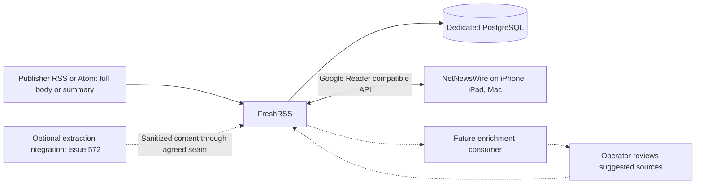

# Self-hosted news reading

## Purpose and decision status

Design for [issue 274](https://forgejo.infra.supermorphic.com/supermorphic/homelab-talos/issues/274):
replace or reduce Apple News dependence with operator-curated reputable sources
and synchronized native reading on iPhone, iPad, and Mac. Select FreshRSS as the
subscription and reading-state authority, a dedicated PostgreSQL service for its
database, and NetNewsWire as the native client.

Issue 274 owns platform deployment, FreshRSS configuration and native-client
integration, subscriptions, categories, filtering, read-state synchronization,
and the initial curated source catalog. It can ship with publisher-provided full
bodies or summaries. [Issue 572](https://forgejo.infra.supermorphic.com/supermorphic/homelab-talos/issues/572)
owns truncated-content detection, public article fetching, extraction, cleanup,
sanitization of extracted HTML, safe fallback, and extraction-quality acceptance.
No extraction engine or package is required for the base platform. The optional
Graby integration has its own [extraction design](034-community-backed-news-extraction.md).

Deploy FreshRSS and its dedicated database to production with retained storage
and operator-encrypted bootstrap, then verify the running service. Production
includes aggregate metrics, alerts, a private-route probe, and recurring read-only
verification. Keep the same deployment, account, subscriptions, and storage after
acceptance; no teardown, reinstall, migration, or separate promotion is required.
Private access describes the internal Gateway and Tailscale path.

Local container acceptance uses synthetic content fixtures to exercise
FreshRSS/PostgreSQL, its synchronization API, and paired backup/restore into
disposable local targets. An off-cluster restore drill, deployed monitoring
acceptance, source/catalog checks, live routing/network/storage checks, and
attended native synchronization are required before treating the production
service as the primary reader or closing issue 274.

Assume one operator account, private access through the existing internal Gateway
and Tailscale path, and a modest curated feed collection. Multiple users, public
exposure, and high-volume archival ingestion require a design review. No evidence
found in this research requires replacing FreshRSS for Talos or NetNewsWire.

## Component boundaries

| Responsibility | Owner | Contract |
| --- | --- | --- |
| Source acquisition and initial catalog | Publisher RSS/Atom feeds selected by the operator under issue 274 | Retain publisher identity, article links, dates, and available bodies or summaries. |
| Aggregation and state | FreshRSS under issue 274 | Own subscriptions, categories, filtering, stored article bodies, read/unread state, and favorites. |
| Full-text extraction and cleanup | Issue 572; community-backed Graby | Supply sanitized complete bodies or preserve useful content on failure through the integration seam below. |
| Optional enrichment and curation | Future independent consumer | Derive annotations and suggestions without taking ownership of subscriptions or reading state. Absent in v1. |
| Native presentation | NetNewsWire under issue 274 | Render the FreshRSS-provided body and synchronize supported state through its FreshRSS account. |

FreshRSS owns feed polling and stored reading state. Native clients synchronize
against FreshRSS. The optional extraction design selects an ingestion extension
and separate Graby worker without making them base-platform dependencies.

## Source acquisition

The operator adds and organizes feeds in FreshRSS. Build an initial curated catalog
of intended reputable publishers, useful categories, and deliberate filter rules.
Prefer publisher-provided full-content RSS or Atom. Summary-only feeds remain
usable with their publisher links; the base platform does not fetch article pages
to expand them. Keep a normal publisher article URL on each item.

Use one subscription path per source. Preserve feed and item identities,
categories, and read state across configuration changes. An actual feed URL change
requires an in-place migration verified against existing articles and read state,
with a backup first. Do not create duplicate subscriptions for future extraction.

Feed polling belongs to FreshRSS. Serialize and bound refresh work, respect
publisher rate limits, and back off on failures. Feeds are rolling windows, not
guaranteed archives; a prolonged outage can lose items that disappear upstream
before the next successful poll. Failed or unavailable feeds must not remove
previously stored items or reading state.

RSS generation for sites without feeds is outside this initiative. Supported
publisher-authenticated or private feeds may use the publisher's documented
mechanism. Keep their credentials in protected runtime configuration and backups,
out of Git, logs, metrics, and public exports. Do not pass credential-bearing
private feed URLs to a public-article extractor. Private feeds with summaries
remain summaries unless the publisher supplies a supported full-content feed.

Keep FreshRSS's normal HTML sanitization enabled for publisher feed content.
Retain safe formatting, editorial images, captions, and publisher attribution where
supplied. Report native image availability honestly; storing article HTML does not
guarantee an offline copy of remote assets.

## Integration seam for issue 572

Issue 274 defines this contract without implementing extraction. Issue 572's
[community-backed extraction design](034-community-backed-news-extraction.md) owns
the selected implementation and its acceptance. Final integration acceptance uses
the delivered FreshRSS and native-client path.

- FreshRSS remains authoritative for subscriptions, categories, filters, stored
  reading bodies, and read/favorite state. Extraction introduces no second user
  state authority and does not require replacing the selected native client.
- Accept sanitized content at the ingestion/storage boundary so the effective
  body reaches the normal FreshRSS synchronization API and native article view.
  Content-based filtering must have a defined ordering relative to enrichment;
  display-only replacement cannot establish native-client delivery.
- Associate results with the existing feed/item identity, publisher URL, original
  feed content, and content revision. The integration must preserve provenance
  and state without manufacturing IDs or duplicate subscriptions.
- A failed, rejected, empty, or unavailable extraction must preserve useful RSS
  content and any previously accepted full body. Extraction failure must not stop
  ordinary headline/summary ingestion. Disabling extraction leaves the base path
  usable; stored articles remain readable independently of an extraction service.
- An adapter, feed conversion, or native-selector approach must prove this contract
  against the pinned FreshRSS version, including relevant updates, sanitation,
  filter ordering, and native caching behavior. Automatic archive backfill is not
  implied by the existence of an update hook.
- Issue 572 owns article-fetch limits, SSRF defenses, publisher access boundaries,
  output cleanup, and representative real-publisher quality validation. It must
  not bypass authentication, subscriptions, paywalls, or anti-bot controls.

The available FiveFilters community container is not an accepted deployment
choice. Issue 274 has no FiveFilters acquisition dependency. Issue 572 instead
uses upstream site configs as a tested dependency of its Graby worker; detailed
extraction acceptance belongs to that design. Image proxying/caching stays
separable unless required for correct extraction.

## Aggregation, state, and recovery

FreshRSS is authoritative for subscriptions, categories, source filtering, stored
HTML, read/unread markers, and favorites. Manage subscriptions and advanced rules
in FreshRSS; NetNewsWire changes to supported reading state synchronize back to
that account. Do not create parallel local/iCloud subscriptions for the same feeds.
FreshRSS saved searches and advanced filters need not appear as equivalent controls
in NetNewsWire. Select server-side effects deliberately: marking an article read is
not the same as excluding it from synchronization or deleting it.

Select a dedicated PostgreSQL service, following
[FreshRSS's recommended database](https://freshrss.github.io/FreshRSS/en/admins/02_Prerequisites.html).
This also provides the documented option of
[PostgreSQL search indexes](https://freshrss.github.io/FreshRSS/en/admins/DatabaseConfig.html)
for a growing article collection. Index selection must account for storage and
write costs. SQLite remains
a simpler supported alternative, but the selected design accepts a separate database
lifecycle for PostgreSQL's upstream recommendation and search capabilities.

Run PostgreSQL as one StatefulSet replica with a retained Longhorn data claim and
a private ClusterIP Service. Reuse the repository's dedicated application-database
pattern described in the
[automation-data platform context](026-automation-data-postgresql-platform.md#existing-platform-context),
with separate FreshRSS database credentials, backup artifacts, and recovery ownership.
The existing n8n and automation-data instances remain dedicated to their respective
contracts. A PostgreSQL operator, database replication, and automatic database
failover are outside v1; a StatefulSet and Longhorn replicas do not supply those
capabilities. PostgreSQL unavailability stops FreshRSS database operations and
synchronization; native clients may continue reading already cached articles.

Before selecting the staged database for rollout, the operator supplies bootstrap
values through `mise exec -- just repo news-secrets`. The recipe defines its exact
input names and write confirmation. It encrypts with the repository's public age
recipient, validates both database and FreshRSS artifacts, and selects both
ciphertexts after validation. It also selects the FreshRSS artifact when upgrading
from the earlier database-only resource selection. It does not need the operator's private age key or
activate Flux. Keep the login and API passwords separate. Retain the operator's
decryption authority for subsequent recovery; synthetic test keys are disposable.

The FreshRSS workload uses an immutable upstream image and repository-owned
startup/configuration scripts. Its upstream entrypoint requires writable system
paths; the selected startup instead runs as an unprivileged user with a read-only
root and bounded writable data/runtime/temp volumes. No custom OCI build or
extraction package is required. Test the pinned image with
`mise exec -- just kube news-local-integration-test`; this creates and removes only
labelled local Podman containers, an isolated network, and disposable volumes.
The suite uses synthetic credentials and feeds and needs no cluster credentials.

First startup initializes the PostgreSQL-backed application, one operator account,
and separate web/API passwords without upstream default subscriptions. A completion
marker allows interrupted account initialization to finish on restart, including
an empty user directory or saved configuration with incomplete database tables.
After that marker exists, restarts preserve the account's web/API passwords; the Secret writer
does not rotate live account or database credentials. Change an established account
through FreshRSS's supported account controls, and coordinate database credential
changes with the database owner. Renaming the bootstrap account requires an explicit
account migration rather than changing the Secret and creating a second user.

Startup reapplies repository-owned system policy, including API/authentication,
fetch limits, and the empty private-host allowlist. Manage subscriptions, categories,
and filters in FreshRSS. The scheduler periodically invokes upstream refresh under
a shared local lock; transient failures leave future refreshes enabled. Per-feed
intervals and upstream cache/rate-limit behavior avoid unnecessary fetches. Ordinary
application/request logs are disabled to keep private feed URLs and credentials out
of logs; supervisor failures report only the failed operation. Readiness checks
the operator's database tables and the HTTP API surface. These checks do not
replace feed-freshness observations or attended native-client acceptance.

The separate metrics listener is reachable only by Prometheus, through a scoped
network policy. It emits fixed aggregate gauges without account names, feed URLs,
article content, or other private labels. A bounded read-only database query
reports active feeds, latest fetch failures, and overdue successful refreshes;
muted feeds are excluded and staleness respects each feed's polling interval.
Scheduler completion is a separate observation: upstream can finish a refresh
while individual feeds fail, or skip recently refreshed feeds. The private Gatus
probe checks the API landing page through the internal gateway, independently of
ingestion. Diagnose individual publisher failures in FreshRSS's private feed UI.

The backup helper publishes local freshness only after a paired set validates and
is atomically completed. It reconstructs that observation from validated retained
sets after restart and during periodic checks; capture failures do not advance it.
Longhorn transfer freshness is a separate off-cluster observation. A current
transfer timestamp cannot prove which paired set it contains or replace the
off-cluster recovery drill.

The base news Flux units, root application selection, Gatus endpoint, and
verification campaign enrollment are enabled together through the reviewed
production deployment change. After
`mise exec -- just kube kubeconfig`, run
`mise exec -- just kube news-verify` with the scoped observer. While staged it
checks that no news workload is running; after activation it requires current
workload readiness and healthy refresh, feed, local-backup, and Longhorn-transfer
observations. These are observational checks, not network-denial, restore, or
native-client acceptance. Initial verification can remain incomplete until the
first scheduled refresh, validated local capture, and Longhorn transfer finish.
An available route alone does not establish service acceptance.

FreshRSS still needs its own retained claim for filesystem configuration and user
settings. Use a single FreshRSS replica with `Recreate` for that `ReadWriteOnce`
claim. Keep refresh scheduling with the application workload and serialize refresh
work. PostgreSQL stores the database; it does not make all FreshRSS state stateless.
Retain logical backups on a separate claim through the established off-cluster
storage path. Pin database versions in executable source; major-version changes
require an explicit migration and restore decision.

The recovery unit is FreshRSS's complete data/configuration plus a consistent
PostgreSQL logical backup and the exact deployed software/configuration revisions.
Any later integration that adds persistent settings or provenance must extend this
recovery contract before rollout. OPML is a
portability aid, not a recovery backup: it cannot restore article bodies, read
state, or all source settings. Upstream describes the
[required data and database backup surfaces](https://freshrss.github.io/FreshRSS/en/admins/05_Backup.html).
Use a coordinated backup of the filesystem state and a consistent `pg_dump`, with
refresh, native-client state writes, and configuration writes quiesced for the paired
backup window. Preserve database ownership/grants through recoverable bootstrap
configuration and operator-managed encrypted credentials. Validate the dump before
publishing backup freshness, then retain the complete backup set off-cluster.
An uncoordinated copy of an active database or a healthy Longhorn replica alone is
insufficient evidence of recoverability.

A PostgreSQL-tool helper in the FreshRSS Pod captures the database and reads the
application data claim through a read-only mount. The supervisor holds a shared
service lock while bootstrapping or serving HTTP; scheduled refresh takes its own
shared lock. A backup requests maintenance, waits for Apache to drain and all
writers to release the lock, then holds it exclusively during capture and
validation. Readiness becomes unavailable during that window; supervisor liveness
continues. A stale maintenance request is cleared only after proving no backup
owner remains. Capture subprocesses retain the locks until they exit, including
when their coordinating shell is interrupted.

Each completed set contains a logical dump, filesystem archive, checksums, and
image/configuration provenance. Publication is an atomic directory rename after
validation; incomplete staging directories cannot establish backup freshness.
The helper retains completed local sets on `news-backups`, which participates in
the existing Longhorn default off-cluster backup policy. Local completion is not
proof that Longhorn has copied that set off-cluster. Confirm the selected set in
off-cluster storage and test its recovery before treating it as retained evidence.
Backups contain private settings and account material and need the same access
restrictions as the live data claim.

Recovery must remain possible without FreshRSS running:

1. Recover the reviewed Git revision, pinned images, encrypted bootstrap material,
   operator-held decryption authority, and a verified off-cluster backup.
2. Restore the dedicated PostgreSQL database into a new isolated data claim and
   restore the matching FreshRSS filesystem backup into a separate new claim. Keep
   polling and client access disabled. Recreate database ownership and credentials,
   and use compatible database tooling and the application revision that created
   the backup before considering migrations.
3. Check database restoration, application database authentication, login, source
   settings, article bodies, categories, favorites, and read/unread state.
4. Enable controlled polling and verify stable item identities and stored content.
   Restore private routing, then reconcile native clients against the recovered server.
   A restore can lose state newer than the backup; do not let stale client queues
   silently undo the verified recovered state.

The recovery entry point is `sh /opt/news/restore.sh <complete-set-directory>`
inside the matching PostgreSQL-tool recovery container. Its `--help` describes
required mounts and inputs. Mount the selected backup read-only, provide an empty
isolated filesystem target and a newly bootstrapped database through the
application role, and keep the application stopped. The command checks the entire
set, image/configuration compatibility, target emptiness, and role before writing.
It restores the database transactionally and then extracts the paired files.
An interrupted restore leaves an incomplete marker that blocks FreshRSS startup;
discard those isolated targets and retry into new ones. Never point this command
at an existing production claim or database.

When opening the isolated application for validation, set
`NEWS_POLLING_ENABLED=false`. This disables the supervisor's scheduler and makes
`refresh.sh` return without fetching or updating refresh freshness. The default is
`true`; other values are refused before startup. Keep the recovered application
off the production route and restrict its network access while checking stored
content. This switch does not prevent an attended UI action or another upstream
entry point from fetching a feed. Enable normal polling only after the recovered
state is accepted.

`mise exec -- just kube news-local-integration-test` proves this path with
synthetic data copied through private temporary host storage into a separate backup
volume. It stops the original local app, database, and backup helper, restores into
new data volumes, and checks stored content and state with polling disabled.
The original volumes are not mounted by the recovery containers. The same local
suite also executes the cluster drill's fixture programs with synthetic volumes.

After Flux has applied `news-recovery-test` and its scoped agent-access rules, run
`NEWS_RESTORE_DRILL_CONFIRM=restore:news:disposable mise exec -- just test record test.news-restore-drill`
from a clean linked worktree with task-scoped credentials. This standalone suite
uses `test-runner`, disposable credentials, and five fresh Longhorn claims in a
restricted namespace with all ingress and egress denied. The app, database, and
backup helper communicate over loopback. It captures two synthetic feeds and
article/category/read/star state, stops the disposable database, and verifies that
FreshRSS readiness becomes unavailable. It removes the source Pod and reattaches
its original claims in a separate Pod that excludes the previous node. The drill
requires an actual node change and unchanged saved state before removing that Pod
and restoring the paired set into fresh claims. It checks the recovered state
through fresh API authentication with polling disabled. Only the backup claim is
shared with the restored Pod, where it is read-only. It never mounts production
storage or credentials.

The result requires successful assertions and cleanup. The private run directory
contains a sanitized outcome and creation-UID ownership ledger. If cleanup fails,
retain that ledger and investigate the named run resources before retrying; do not
adopt or delete replacement objects. Namespace policy and quota are checked before
mutations. Deployed network-denial acceptance remains separate from these source
and baseline checks. This drill proves database-outage readiness, state preservation
through cross-node claim reattachment, and logical recovery into fresh claims;
confirmed Longhorn off-cluster recovery and native-client reconciliation remain
required before primary use or issue closure.

An isolated restore drill is required before treating this as the primary reader.
Capacity, retention, backup frequency, and concrete guarded recovery commands belong
to implementation configuration and command help once the design is approved.
Unread and starred content must not be silently discarded to satisfy a storage cap.

## Native presentation and optional image privacy

NetNewsWire is the selected free native iPhone/iPad/macOS client. No subscription,
advertisements, or upgrade nagging is an acceptance requirement for the client. Its
[published features](https://netnewswire.com/) include FreshRSS synchronization.
Use FreshRSS's self-hosted
[Google Reader–compatible synchronization API](https://freshrss.github.io/FreshRSS/en/developers/06_GoogleReader_API.html)
over trusted HTTPS, authenticated with a separate FreshRSS API password. This
community-supported compatibility interface has no dependency on Google's
discontinued service. Prefer it over the Fever API, consistent with
[FreshRSS's mobile-access guidance](https://freshrss.github.io/FreshRSS/en/users/06_Mobile_access.html).
It is a de facto compatibility protocol, not a formally standardized open protocol.
Preserve encoded API paths through Envoy. Avoid an interactive authentication proxy
that intercepts native API calls.
Device OS compatibility must be checked against the chosen stable NetNewsWire release.

The current [NetNewsWire Reader API implementation](https://github.com/Ranchero-Software/NetNewsWire/blob/main/Modules/Account/Sources/Account/ReaderAPI/ReaderAPIAccountDelegate.swift)
maps the API's `summary.content` into article HTML. Despite that field name, it can
carry the full stored body. Verify rendering of publisher-provided full bodies and
summaries in the normal article view on the operator's installed clients. Future
extracted bodies use this same path; client-side reader mode is not evidence for
server-side extraction acceptance.

Synchronize subscriptions/categories and bidirectional read/unread and starred
state. The operator selected the configured Mac as sufficient for native-client
acceptance; iPhone and iPad checks are optional and must not be reported as tested
without separate evidence. Offline/reconnect checks are optional and are not
required for issue closure. Report them as tested only with separate evidence.
Do not promise immediate background sync on iOS, identical advanced-filter UI, or
automatic replacement of cached bodies. Offline text depends on prior client sync;
offline image availability requires separate testing.

Image proxying/caching is optional and disabled in the base design. Without it,
native clients may contact publisher/CDN image hosts; HTML cleanup does not remove
that privacy exposure. A future proxy must rewrite image URLs in the HTML delivered
by the API, including responsive-image alternatives, not just the FreshRSS web UI.
It must use a client-reachable private HTTPS endpoint, work without browser session
cookies, and avoid exposing long-lived account credentials in URLs. Restrict it to
approved image fetches with bounded cache size and lifetime. Prove publisher/CDN
requests disappear from native-client traffic before claiming image privacy. Images
already cached by clients cannot be retroactively brought under that guarantee.

## Optional enrichment and curation seam

Keep v1 usable with no enrichment process, model, queue, vector database, or extra
article archive. A later consumer may read FreshRSS articles through a supported
API using the narrowest available access. The Google Reader API is not inherently
read-only; do not describe a full API credential as a read-only authorization.
Any future service identity and write boundary need their own design review.

Associate derived results with a stable FreshRSS article identity, source identity,
original/canonical publisher URL, and content revision/hash. Keep derivation/model
provenance separate from publisher content. This is an interface boundary, not a
new registry or schema to build in v1. Derived state is disposable and can be
recomputed; FreshRSS retains authority over the originals and user state.

This permits cross-source duplicate grouping, semantic categories, personalized
ranking, a separate For You view, suggested sources, and local-LLM summaries.
Deduplication should initially group related copies without destroying the originals
or their separate read markers. Summaries must be labeled as generated, retain
publisher attribution, and never replace the editorial body. Article content is
untrusted input and cannot issue subscription or tool commands to an enrichment job.

Recommendations go to an operator review surface. Only operator approval adds a
source to FreshRSS. Disabling enrichment must leave ingestion, stored-article reading,
filtering, and synchronization intact. NetNewsWire is not assumed to support custom
ranked streams or arbitrary annotations; a future For You presentation may need a
separate view. Do not distort v1 feed ordering or manufacture duplicate subscriptions
to simulate that feature.

## Platform fit and operating boundaries

Follow the [Talos/Flux platform](010-talos-flux-platform.md) with a dedicated news
namespace and app-local Flux packages for FreshRSS and its dedicated PostgreSQL
service. Order FreshRSS startup after database readiness. Use the existing internal
Gateway, certificate, DNS, and private Tailscale route for the FreshRSS UI/API.
Public exposure and new Talos host services are outside this design. PHP and the
web server belong in containers; no host package installation is needed.

Admit workloads under restricted Pod Security: non-root execution, dropped
capabilities, no privilege escalation, no host mounts, and no Kubernetes
service-account token. Container startup, writable paths, and refresh scheduling
must be proven under those settings before image selection is complete; a Docker
Compose example alone does not prove Kubernetes compatibility. Pin admitted
application/runtime images in executable source and verify amd64 support.

Apply default-deny network policy with scoped ingress, DNS, public publisher
HTTP(S), and FreshRSS-to-database access. PostgreSQL accepts only application,
backup, and required monitoring traffic. Validate feed destinations and redirects;
exclude private, loopback, link-local, metadata, and cluster destinations from
publisher fetching. A publisher feed is untrusted even when the operator selected
it. Issue 572 owns any additional extractor-specific network path and article
fetching controls. Do not pre-open an internal-fetch exception for an unselected
extractor. Validate these as new-service admission requirements, not claims about
existing deployed controls.

Bound feed response size, redirects, refresh time, concurrency, and temporary disk
use. Independent probes distinguish serving FreshRSS from successful feed
ingestion. Observe database availability, backup freshness, and refresh freshness
as well as Pod health. A working homepage alone does not prove native
synchronization. Logs and metric labels must omit article text, query strings,
private feed URLs, and credentials.

## Alternatives and tradeoffs

| Approach | Decision and reason |
| --- | --- |
| Miniflux | Credible minimalist alternative, but its [documented feature set](https://miniflux.app/features.html) is less aligned with the operator's FreshRSS filtering and source-management preference. No discovered compatibility issue justifies switching. |
| NewsBlur | Its [learning and larger service stack](https://www.newsblur.com/about/) are relevant only if learning/discovery becomes a current requirement worth the extra operational cost. Not selected for hypothetical future use. |

## Acceptance and remaining design decisions

The base architecture is selected. Remaining admission work covers the FreshRSS
container, database compatibility, configuration, recovery lifecycle, and native
synchronization. Database-only local acceptance does not establish a deployed
reading service. Keep FreshRSS and NetNewsWire unless an actual incompatibility is
demonstrated. Extraction research and acceptance belong to issue 572 and do not
block issue 274. Implementation authorization does not authorize deployment.

The operator selects the initial curated catalog and a small representative set
of its feeds, including full-content and truncated feeds. Record categories,
filtering intent, and observed publisher-provided content in retained acceptance
evidence without publishing private subscriptions or copyrighted article bodies.
Snippet-only content is an expected base-platform result, not failed extraction.

Required evidence before the base deployment is accepted:

- Verify subscriptions, categories, and deliberate FreshRSS filter behavior against
  the initial source catalog. Compare publisher feed bodies with stored FreshRSS
  HTML, API responses, and native rendering, including safe formatting and supplied
  images/captions. Use independently authored synthetic fixtures for automated
  contracts; do not test documentation prose.
- Verify stable item identity, no duplicate subscriptions or read-state reset on
  repeated polls, and preservation of stored items when a feed is unavailable or
  invalid. Exercise full-content and summary-only feeds without an extractor.
- Perform Mac checks for normal article rendering,
  categories, bidirectional state, and LAN/off-LAN
  private access. Record limits of cached-body updates and remote image access.
- Prove container restrictions, storage restart/rescheduling, bounded refresh work,
  private network boundaries, database-outage behavior, and restoration of the
  paired PostgreSQL and FreshRSS filesystem recovery unit, including credentials.
- Keep the issue 572 integration seam reviewable and independent of base rollout;
  implementing or accepting extraction is not an issue 274 completion condition.

These remain pending native/runtime acceptance, distinct from database-only tests,
source inspection, and mechanical documentation validation. Local or hosted
offline checks cannot prove the intended reading experience. Production
deployment requires admitted base-platform packages, encrypted bootstrap material,
the complete recovery and workload lifecycle, and successful isolated cluster
recovery. Its exact candidate and base must pass hosted validation and receive
explicit authorization for the specific merge. Then verify the deployed route,
monitoring, storage and network boundaries, confirm a paired set is recoverable
from off-cluster storage, and complete the attended client checks above. The
production service remains deployed while these checks run and after they pass;
only disposable recovery-test resources are removed. Complete the required checks
before accepting it as the primary reader or closing issue 274. Graby remains
suspended and new extraction requests remain disabled during base-platform
acceptance.
