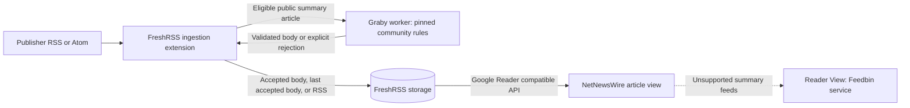

# Community-backed news extraction

## Purpose and scope

Design for [issue 572](https://forgejo.infra.supermorphic.com/supermorphic/homelab-talos/issues/572):
deliver complete public articles to the native reader while leaving publisher
extraction rules with an upstream community. Select Graby with unchanged
FiveFilters community site configs, integrated at FreshRSS ingestion. NetNewsWire
Reader View supplies a separate client fallback for unsupported summary feeds.

[Self-hosted news reading](033-self-hosted-news-reading.md) owns the base platform,
subscriptions, filtering, synchronization, storage, and recovery. This design owns
the optional extraction worker, its FreshRSS extension, extraction safety, and
tested dependency updates. FreshRSS remains usable when extraction is disabled or
unavailable. This specification describes intended production behavior; spike
results do not establish that the production integration is implemented.

The maintenance constraint is central: no locally authored publisher selectors,
private site-config fork, custom container images, or maintained Dockerfiles.
The repository does own a small generic worker and FreshRSS extension, a Composer
lock, separate community-rule pins, and their validation. Browser rendering,
authentication/paywall bypass, additional extraction engines, archive backfill,
image proxying, and a second article database are outside this design.

## Content paths and ownership

Keep one publisher subscription and its existing item identity. Feed-level modes
select ordinary RSS delivery or community-backed enrichment; modes contain no
publisher extraction logic. A recognized rule is necessary but does not alone
enable a source: representative public articles must pass quality acceptance.
Rich feeds remain on ordinary RSS delivery without article fetching or rewriting.

WIRED, Ars Technica, and Car and Driver are initial enrichment candidates.
MacRumors, Colorado Newsline, and Mile High Report retain their rich RSS bodies.
Unsupported summary sources, including the tested 9to5Mac, Engadget, TechCrunch,
and The Decoder paths, retain RSS and use Reader View. Restricted Verge content
retains the publisher's available RSS body. Source coverage can change through
validated upstream updates; no fixed publisher count is an adoption requirement.
The source catalog remains owned by the base platform.

## Community-rule-only acceptance

Use [Graby](https://github.com/j0k3r/graby) with
[FiveFilters site configs](https://github.com/fivefilters/ftr-site-config) obtained
from an immutable upstream revision. The Composer-packaged
[graby-site-config](https://github.com/j0k3r/graby-site-config) dependency and the
actual FiveFilters rules loaded by the worker have separate identities. A locked
Composer installation alone does not reproduce the rules validated in the spike.

For every article, establish the intended host-specific community rule and its
revision, an explicit body selector, and an actual body match. Global defaults,
a filename match, a nonempty result, or HTTP success cannot establish acceptance.
Disable generic body autodetection through Graby's supported configuration. Reject
unknown hosts, bodyless rules, failed selectors, login requirements, and any
unexpected generic extraction. Evaluate redirects against the same policy.

Upstream rules remain unchanged. A generic caller policy may disable network
follow-ups and unsafe behavior uniformly. Reject a rule-dependent path that needs
credentials, browser execution, or unsupported additional-page fetching. Report
missing or broken publisher rules upstream; use RSS while awaiting a tested fix.
Do not patch publisher selectors locally to keep a source enabled.

Validate extracted content before accepting it. Reject empty or malformed output,
subscription/interstitial pages, blocked responses, and implausibly incomplete
bodies. Preserve editorial paragraphs, image order, captions/credits, headings,
lists, links, and tables. Conservative generic guards supplement reviewed corpus
coverage; they cannot prove completeness for an arbitrary page. A clean-looking
result with substantial editorial omissions fails acceptance. Incidental shopping
or subscription promotion is an accepted quality limitation where removing it
would require local publisher rules or risk editorial loss. Publisher navigation,
comment sections, and full-page chrome remain quality failures.

## FreshRSS ingestion, persistence, and fallback

Use a FreshRSS extension at the entry ingestion hooks, before content filters and
initial storage. Store the selected body as ordinary entry content so it reaches
the synchronization API and normal native view. Filters evaluate that selected
body. Disable competing native full-content selectors for enrichment-managed
feeds. The update hook validates the final entry without fetching a second time.
Do not depend on a web UI replacement or a converted feed subscription.

The insert hook also participates in upstream entry updates. Processing must be
idempotent across both hooks and repeated polling. Preserve the upstream RSS
change-detection hash, including enclosure-bearing articles, so enrichment and
its metadata do not manufacture feed changes. An unchanged poll must neither
fetch again nor change read/unread state. Preserve publisher identity, GUID,
stored item ID, title, article link, dates, categories, and favorites. Existing
FreshRSS update/filter policies still govern genuine publisher changes; extraction
does not add a new unread/star policy.

Keep the original RSS body and extraction provenance in the same FreshRSS entry
using supported entry attributes. Provenance associates the accepted body with
the feed/item, publisher URL, input revision, matched rule, and tested release.
Accepted content and its provenance commit together through FreshRSS's normal
storage path. Keep metadata bounded and subject to normal entry retention. No
worker database or separate permanent article cache owns accepted bodies.

An accepted replacement must pass validation before replacing stored content.
When fetching or validation fails, use the existing accepted full body if present;
otherwise use the publisher RSS body. This applies to empty, malformed, restricted,
HTTP-denied, timeout, interstitial, unknown-rule, and unavailable-worker outcomes.
Do not clear prior accepted content, drop the entry, fabricate a successful result,
or lose the RSS snippet. Keep prior accepted provenance when retaining that body.
Avoid reusing a cached result for another feed/item or article URL.

The extension must preserve this contract during publisher updates, worker
restarts, disabled enrichment, and mixed old/new release operation. Failures must
return a usable entry to FreshRSS. A storage error must not leave a partially
accepted body/provenance pair. To disable enrichment safely, keep the extension
enabled with extraction requests disabled so its preservation hooks still run on
publisher updates. Disabling or removing the extension leaves already stored
bodies readable but stops that preservation behavior. Either action requires
freezing affected updates or accepting a deliberate return to publisher RSS after
a backup.

Initial enrichment is synchronous with a short bounded delay before first
storage. Articles stored as RSS because of worker unavailability, saturation, or
refresh-budget exhaustion are not retried when the worker recovers. They remain
RSS unless the publisher changes the feed entry and a later ingestion attempt
accepts enrichment. Reader View remains available for these articles. There is no
automatic background reprocessing of previously synchronized snippets. A later
reprocessing feature would need separate acceptance for existing item identity,
concurrent state changes, and native client caches.

## Worker interface and failure isolation

The internal worker accepts a bounded public article URL and expected release
identity. It returns a validated body with provenance or a structured rejection
reason. Reject malformed, oversized, or release-mismatched replies in FreshRSS.
The worker has no FreshRSS database credentials, subscription management, user
state writes, public route, or general-purpose proxy interface. Limit callers to
the intended FreshRSS workload under the base platform's network boundaries.

Expose readiness only for the completely initialized release. FreshRSS checks
availability once per refresh context with a deadline of at most one second.
Connection failure, unready status, release mismatch, or sustained overload opens a circuit breaker:
skip subsequent worker calls during a bounded cooldown. A circuit breaker stops
repeated requests to a failing service. Its temporary state needs no backup.
An individual publisher denial backs off that origin without disabling others.

Bound each request and total enrichment time for a refresh. Exhausting the shared
budget switches remaining entries to fallback so ordinary feed ingestion can
finish within the base refresh deadline. Enrichment may consume at most one fifth
of that deadline, with at most ten seconds for one article, including fetching,
extraction, and reply handling. Busy admission returns promptly rather
than creating an unbounded queue. Do not retry unavailable workers for every
article or put worker readiness in FreshRSS's own readiness requirement.

## Published runtime and initialization

Keep FreshRSS on its published upstream image. Run Graby separately on a published
[TheCodingMachine PHP CLI runtime](https://github.com/thecodingmachine/docker-images-php),
pinned by immutable digest. Mount generic application code and release inputs from
Git-managed artifacts. This deployment requires neither a custom image build nor
a repository Dockerfile. Image size, CPU architecture, and runtime support remain
release validation concerns.

Initialize a fresh temporary dependency volume before serving requests:

1. Verify the mounted release inputs and prepare a private staging directory.
2. Run Composer `install` against the exact committed lock, with development
   dependencies, scripts, and plugins disabled. Never run `update`, ignore platform
   requirements, or install OS packages during production startup.
3. Obtain the separately pinned upstream rules and verify revision and artifact
   integrity. Select that verified directory as the authoritative rule source;
   reject an accidental packaged/default-rule directory or mixed revisions.
4. Verify the installed lock, PHP platform requirements, required extensions, and
   rule-loading policy. Run an offline smoke case that proves the expected rule
   matches and generic fallback is refused.
5. Publish the completed dependency/rule set atomically, then expose readiness
   with the verified release identity. Runtime code and rules are read-only.

[Composer's installation controls](https://getcomposer.org/doc/03-cli.md#install-i)
support the locked installation and script/plugin restrictions. Invoke the real
PHP binary directly; do not rely on image convenience wrappers that need writable
system configuration or privilege escalation. Enable required preinstalled
extensions explicitly. Use the same runtime for initialization and execution.

Initialization must complete or fail within five minutes, with at most two
installation attempts inside that deadline. All dependency/rule download retries
share that deadline; apply restart backoff after failure.
Failure never serves a partial installation or substitutes newer
dependencies. Package-host outages can delay a cold start; they must not prevent
FreshRSS from ingesting RSS or reading stored articles. Test that condition before
deployment. A prepared dependency bundle is a later alternative only if measured
cold-start availability requires its additional artifact lifecycle.

## Fetch and HTML safety

Fetch public HTML with ordinary HTTP before passing prefetched content to Graby.
The fetcher is the only permitted article-network path: community directives must
not create secondary requests outside its controls. Do not attach publisher
credentials, session cookies, private feed tokens, or environment proxy settings.
Do not bypass subscription gates, HTTP denials, or anti-bot challenges.

Enforce finite DNS, connection, read, and total deadlines; redirect count;
compressed and decompressed response limits; parser memory/CPU; and global and
per-origin concurrency. Bound admitted requests and temporary storage. TLS
verification is required. Accept HTTP(S) on standard ports, refuse URL credentials,
HTTPS downgrade, non-HTML responses, and unsupported redirect schemes.

Apply public-network destination validation to every resolution and redirect,
including IPv4/IPv6 and mixed address sets. Pin approved addresses to the actual
connection to prevent DNS rebinding. Refuse private, loopback, link-local,
cluster, and other non-public destinations. Test that parsing/extraction cannot
escape the fetcher through alternate or multipage directives. Run without root,
capabilities, privilege escalation, writable system files, or service-account
credentials. Define executable limits and test boundary values before rollout.

Respect rate limits and `Retry-After`. No inline retry for denied, restricted, or
blocked content. Any transient retry is bounded, delayed, and subordinate to the
refresh budget. Retained accepted bodies may supply conditional requests using
ETag/Last-Modified; a 304 can reuse content only with matching article provenance.
If that content no longer exists, preserve RSS rather than claim cache success.

Sanitize accepted HTML with a generic positive element/attribute/URL policy and
keep FreshRSS's normal sanitation enabled. Remove scripts, forms, executable
embeds, event handlers, unsafe URLs, and active styles. Preserve safe editorial
images, figure captions, tables, formatting, and resolved links. Native clients
continue to load images directly from public publisher/CDN hosts under the base
platform's accepted privacy boundary; this design provides no offline image or
image-proxy guarantee.

## Tested releases and recovery

Treat the runtime image digest, Composer lock, generic worker/extension revision,
and community-rule revision as one tested release. Include its FreshRSS
compatibility target. Keep immutable release inputs and sufficient provenance to
reproduce the extraction. Do not float tags, branches, dependencies, or rule files
at startup, and do not update a running worker's rules in place.

When upstream publishes a rule change, prepare a candidate pin and automatically
replay the retained regression corpus through the candidate release. A passing
candidate may enter the normal reviewed Git promotion path; a failure retains the
previous pin and supported source modes. Missing corpus inputs or incomplete
validation block promotion. Retrieve retained real-article fixtures from protected
evidence storage; public synthetic fixtures test generic invariants without
publishing publisher articles. Validation does not authorize merging.
Exercise this policy with both a real upstream update and a deliberately broken
rule. Runtime, dependency, and integration changes use the same gate; review newly
supported sources against live public pages before enabling enrichment.

Rollback restores the previous complete release and compatible extension together.
Release mismatch during transition uses fallback. A candidate must not replace
accepted production bodies before its validation passes. Corpus checks cannot
repair content already delivered, so conservative runtime rejection remains
necessary after promotion. Retain regression evidence in established evidence
stores; do not commit publisher article bodies or client screenshots publicly.

Original RSS, accepted bodies, provenance, and persistent extension/feed settings
belong to FreshRSS's existing paired recovery unit. Extend backup provenance and
restore compatibility checks to include the extraction release. Extraction-aware
paired sets use `news-paired-v2` and bind the actual mounted release and extension
bytes. Restore a `news-paired-v1` set with its matching historical software and
configuration, without extraction inputs, before migration; do not relabel it. Preserve the
base maintenance locks for all entry/configuration writes. The worker's temporary
dependencies, request cache, and circuit state are reconstructible and need no
PVC or separate backup. Prove restored content and state remain readable while
the worker or package hosts are unavailable.

Record aggregate acceptance/fallback reasons, worker readiness, initialization
failures, request latency, and refresh-budget exhaustion using the established
monitoring path. Keep article bodies, credentials, and detailed private URLs out
of metrics and public logs. Headline ingestion and extraction availability are
separate observations; a functioning RSS fallback must not report full-text
extraction success.

## NetNewsWire behavior and acceptance

Enriched and rich RSS articles use NetNewsWire's ordinary stored-content view.
For unsupported summary feeds, configure the client's per-feed Always Use Reader
View option. Occasional failures on enriched feeds can use Reader View manually.
Reader View remains inside NetNewsWire but uses
[Feedbin's external service](https://netnewswire.com/frequently-asked-questions.html).
That accepted external dependency fetches independently of Graby and does not
write its result back to FreshRSS. It may fail, omit images, or retain promotion;
restricted articles remain restricted. Publisher click-through remains available.

Production acceptance must prove the implemented integration, beyond the earlier
stored-content and native macOS spike:

- Replay the original 17-article corpus with strict community-only behavior and
  preserve rich feeds unchanged. Add validated intended sources without local
  selectors. Judge completeness against editorial reference content, not merely
  byte equality or a successful response. Unsupported galleries use RSS.
- Check real public fetching, matched rules, ordered media/captions, structure,
  cleanup, and subscription detection. No routine browser dependency is allowed.
- Exercise every rejection class through actual FreshRSS ingestion, first inserts,
  publisher updates, repeated unchanged polls, and entries with enclosures. Check
  accepted-body retention, original RSS, item identity, filters, and user state.
- Test worker absence, cold-start package-host failure, interrupted initialization,
  release mismatch, saturation, aggregate time limits, hostile fetch inputs, and
  malformed/oversized worker replies. Prove prompt fallback and no partial readiness.
- Simulate passing and failing upstream-rule releases, rollback, and paired
  backup/restore with extraction unavailable. Run the published runtime on the
  cluster's CPU architecture with the intended process restrictions.
- Verify API delivery and actual native rendering separately: text, hero/inline
  images, captions, headings/lists/tables when present, links, light/dark usability,
  and read/favorite sync. Test Reader View separately on summary sources. Preserve
  the base platform's attended iPhone/iPad, offline, and client-cache requirements.

Production adoption requires these integration and operational gates to pass.
If they require ongoing local publisher rules, widespread browser rendering, or
unsafe generic fallback, retain direct rich RSS plus summaries/Reader View and
stop extending custom extraction work.
